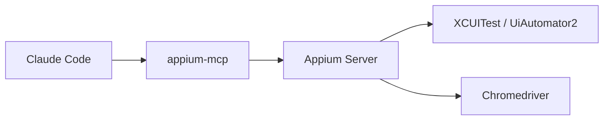
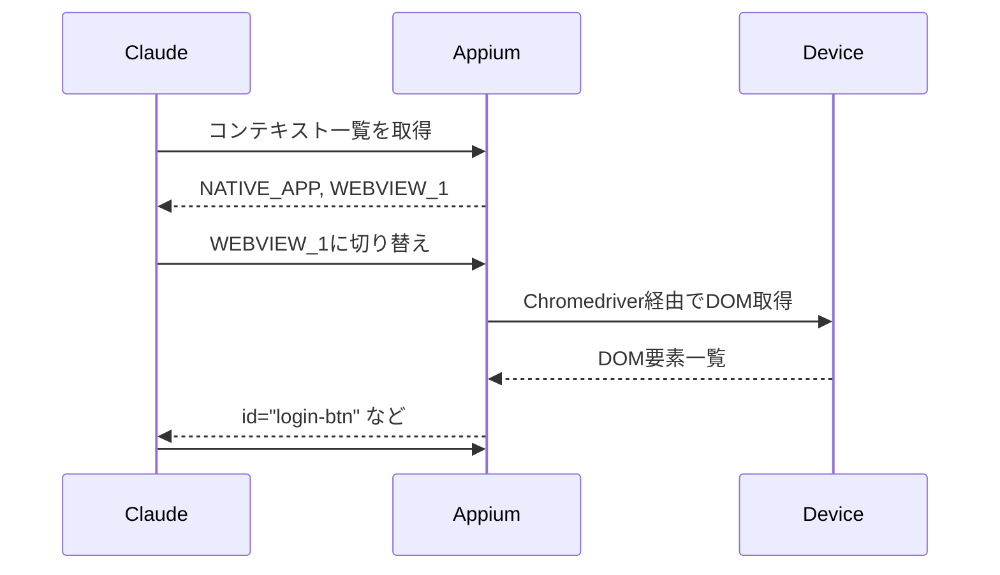

**AIエージェントでモバイルアプリを操作したい。**

そう思ってMCPサーバーを探すと、まず目に入るのがmobile-mcpです。日本語記事も複数あり、セットアップも簡単そう。

しかし、WebViewを含むアプリで試したところ、ある壁にぶつかりました。**アクセシビリティツリーからWebView内部の要素が見えない**のです。

ログインフォームをタップしたつもりが隣のボタンを押してしまったり、URLパラメータが正しいかを確認できなかったり。開発効率が著しく下がりました。

そこで試したのが**appium-mcp**です。モバイル自動化フレームワークAppiumの公式MCPサーバーで、WebViewのコンテキスト切り替えやテストコード生成など、Appiumの機能をそのまま使えます。

この記事では、両者の技術的な違いと、appium-mcpに切り替えた理由を解説します。

## この記事で得られること

- mobile-mcpとappium-mcpのアーキテクチャの違い
- WebView操作でappium-mcpが優位な技術的理由
- それぞれの設計思想と得意な場面
- appium-mcpのセットアップ概要

## 結論

| ユースケース | 推奨 |
|-------------|------|
| WebViewを含むアプリ | **appium-mcp** |
| テストコード自動生成が必要 | **appium-mcp** |
| 入力精度を重視 | **appium-mcp** |
| セットアップを最小限にしたい | mobile-mcp |
| 詰まっても前進したい | mobile-mcp |

:::message
mobile-mcpはセットアップが簡単で、軽い動作確認には十分です。WebView対応や入力精度を求めるならappium-mcpが優位ですが、両者は設計思想が異なるため、用途に応じて選ぶのが正解です。
:::

## 動作比較デモ

同じフォーム入力操作を両MCPで実行した結果です。

### ネイティブUI操作

| mobile-mcp | appium-mcp |
|:---:|:---:|
|  |  |

シンプルな操作では速度差はほとんどありません。どちらも全フィールドに入力できています。

### WebView操作

| mobile-mcp | appium-mcp |
|:---:|:---:|
|  |  |

mobile-mcpではUsernameフィールドに日本語が混入しています。これはキーボードシミュレーションを使用しているためで、シミュレータのキーボード設定に依存します。appium-mcpは`set_value`で直接値を設定するため、キーボード設定の影響を受けません。

## 両者の概要

| 項目 | appium-mcp | mobile-mcp |
|------|-----------|------------|
| 初回リリース | 2025/3/31 | 2025/3/30 |
| 現在のバージョン | v1.9.x | v0.0.42 |
| メンテナー | Appium公式 | コミュニティ |
| 日本語記事 | ほぼなし | 5件以上 |

## 設計思想の違い

両者は同じiOS自動操作でも、狙っているところが違います。

### appium-mcp: 自動化の継続運用

Appiumの流儀をそのままMCPに載せたものです。

- capabilitiesを用意してセッションを張り、要素を探して操作する
- iOSではWDAを使う前提で、Simulator起動やWDAセットアップをツール側に押し込めている
- locator生成やテスト生成、ドキュメント参照など周辺機能も含む

**自動化を継続運用する発想**で組まれています。



### mobile-mcp: LLMの手足

LLMが扱いやすい抽象化を中心に置いています。

- iOSとAndroidの違いを吸収
- 画面の要素一覧をアクセシビリティのスナップショットとして渡す
- 操作はタップ、スワイプ、入力といった粒度に揃える
- 要素が取りきれないときは座標操作に落ちる

精密なテストというより、**止まらず前に進めることを優先した設計**です。


## WebView問題の深掘り

WebViewを含むアプリでの挙動の違いを見てみましょう。

### mobile-mcpの場合

mobile-mcpでWebViewを含む画面を取得すると、WebView全体が「1つのビュー」として認識されます。

```
- ネイティブヘッダー
- WebView ← 内部のボタンやフォームが見えない
- ネイティブフッター
```

WebView内のDOMにはアクセスできないため、座標指定でタップするしかありません。画面サイズが変わると座標がずれ、操作が失敗します。

実際の開発で遭遇した問題：
- **誤タップ**: ログインフォームを操作しようとして、隣の「Apple Sign In」ボタンを誤タップした
- **状態確認が困難**: WebViewが正しくロードされたか、URLパラメータが正しいかを確認できない
- **デバッグ効率の低下**: エラー発生時にWebView内の状態を直接確認できず、原因特定に時間がかかる

### appium-mcpの場合

appium-mcpはコンテキスト切り替えによってWebView内部のDOMに直接アクセスできます。



WebView内のボタンやフォームをIDやCSSセレクタで指定できるため、**画面サイズに依存しない安定した操作**が可能です。

appium-mcpならできること：
- `#login-btn`のようなCSSセレクタで確実にボタンを特定
- `window.location.href`でURLパラメータ（actトークン等）を確認
- フォームの入力値やエラーメッセージをDOMから直接取得

## ネイティブ操作でも差が出る

WebView以外のネイティブUI操作でも、appium-mcpは入力方式と要素特定で優位です。

### 入力方式の違い

mobile-mcpはキーボードシミュレーションで文字を入力します。シミュレータの言語設定やキーボード状態に依存するため、意図しない入力になることがあります。

appium-mcpは`set_value`で要素に直接値を設定します。キーボード設定の影響を受けないため、**確実に意図した値を入力**できます。

### 要素特定の違い

mobile-mcpはスクリーンショットとアクセシビリティ情報を組み合わせて要素の座標を特定します。セットアップは簡単ですが、画面サイズや解像度で座標がずれる可能性があります。

appium-mcpは複数のロケーター戦略を優先度順に試行します。

1. **Accessibility ID** - 最も安定（開発者が設定した識別子）
2. **ID** - プラットフォーム固有のID
3. **XPath** - DOM構造から特定
4. **座標** - 最終手段

座標に頼るのは最終手段であり、基本的にはセマンティックな識別子で要素を特定します。

## appium-mcpの注意点

appium-mcpを推奨しましたが、万能ではありません。

### 精度の源泉はAppiumではない

iOSが提供するアクセシビリティ情報が薄ければ、Appiumでも拾えません。SwiftUIの構造が複雑だったり、動的リストで要素が頻繁に入れ替わったりすると、要素ベースの操作は頭打ちになります。

### 速度は条件次第

要素ベースだから速いとは言い切れません。iOSのWDAは要素探索やページソース取得の裏側でUIツリーを収集し、整形して転送します。画面が重いと秒単位で効き、スクロールやアニメーション中はさらに不安定になりやすい。

### 失敗時の復帰が重い

WDA起動やセッション周りでこけると復帰に時間がかかります。一方、mobile-mcpは要素が取れないときに座標へ落ちるので、多少荒くても前進できる余地が残りやすい。LLMに触らせて探索と確認を回す用途では、mobile-mcpの前進力が効く場面もあります。

## 機能比較

| 項目 | appium-mcp | mobile-mcp |
|------|-----------|------------|
| 入力方式 | 直接値設定 | キーボードシミュレーション |
| 要素検出 | ロケーター戦略 | アクセシビリティ+座標 |
| WebView対応 | コンテキスト切り替え | 座標のみ |
| テストコード生成 | Java/TestNG | なし |
| 複雑なジェスチャー | 対応（ピンチ、長押し等） | 限定的 |
| 失敗時の復帰 | 重い | 軽い |
| セットアップ | 複雑 | 簡単 |

appium-mcpは操作履歴をJava/TestNGのテストコードとして出力できます。AIエージェントに探索させた操作をそのままE2Eテストに転用できるのは、テスト資産化を狙う用途で大きなメリットです。

## セットアップ

### 前提条件

- Claude Codeがインストール済み
- Node.js v22+
- Java 8+（appium-mcpのみ）

### mobile-mcp

```bash
claude mcp add mobile-mcp -- npx -y @mobilenext/mobile-mcp@latest
```

これだけでセットアップ完了です。

### appium-mcp

Appiumと必要なドライバーをインストールします。

```bash
# Appiumのインストール
npm install -g appium

# ドライバーのインストール
appium driver install uiautomator2  # Android用
appium driver install xcuitest      # iOS用
```

Claude Codeに追加します。

```bash
claude mcp add appium-mcp -- npx -y appium-mcp@latest
```

:::message
iOSの場合はXcodeのインストールも必要です。`xcode-select --install`でコマンドラインツールをインストールしてください。
:::

## まとめ

- **セットアップを最小限にしたい** → mobile-mcp（軽量・簡単）
- **WebView対応・入力精度を重視** → appium-mcp（高精度・多機能）

WebViewを含むアプリや、確実な入力が必要な場面ではappium-mcpをおすすめします。

ただし、両者は設計思想が異なります。appium-mcpは自動化の継続運用、mobile-mcpはLLMの手足として止まらず進むことを重視しています。**失敗したときに何が起きるかまで含めて、用途に合わせて選ぶ**のが正解です。

## 参考リソース

- [appium-mcp (GitHub)](https://github.com/appium/appium-mcp)
- [mobile-mcp (GitHub)](https://github.com/mobile-next/mobile-mcp)
- [Appium Hybrid App Testing](https://appium.github.io/appium.io/docs/en/writing-running-appium/web/hybrid/)
