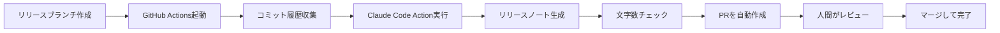

モバイルアプリをリリースするたびに、こんな作業をしていませんか？

- コミット履歴を見ながら「これは書く？書かない？」を判断
- 「事前ロード実装」→「読み込みが速くなりました」のように技術用語を翻訳
- 300-500文字に収まるように文章を調整
- 専門用語が残っていないかチェック
- トーンが前向きで明るいか確認

そこまで時間はかからないものの、**毎回同じようなことを繰り返すのは面倒**ですよね。しかも複数人で書くと品質がバラバラになる。

「変更差分から自動でいい感じに生成してくれたら楽なのに...」

そこで、GitHub ActionsとClaude Code Actionを使って、変更差分から自動でリリースノートを生成する仕組みを作りました。この記事では、その方法を詳しく解説します。

## この記事で得られること

- リリースノート自動生成の仕組み全体像
- AI生成の品質を担保するガイドライン設計ノウハウ
- GitHub Actionsとの統合方法
- すぐに使えるワークフローファイル
- 実際の生成例とトラブルシューティング

## 自動化の全体像



ポイントは、**完全自動化ではなく「下書き自動生成＋人間レビュー」**にしたこと。AIが生成した内容を人間が確認・修正できるフローにすることで、品質を保ちつつ作業時間を大幅削減できます。

## セットアップ手順

この記事では、Claude Code CLIを使った最も簡単なセットアップ方法を紹介します。

### 前提条件

- Claude Codeがインストールされている
- GitHubリポジトリがある

### 1. Claude Code OAuth トークンの設定

Claude Codeでプロジェクトを開き、以下のコマンドを実行：

```bash
/install-github-app
```

このコマンドで以下が自動的に行われます：
- GitHub App のインストール
- リポジトリへのアクセス権限の設定
- `CLAUDE_CODE_OAUTH_TOKEN` シークレットの自動作成

対話的にセットアップが進むので、画面の指示に従ってください。

### 2. リリースノートガイドラインの作成

Claude Codeで以下のプロンプトを実行：

```
docs/release-notes-guideline.md を作成してください。
以下の内容を含めてください：
- App Store用リリースノートの書き方ガイドライン
- 技術用語からユーザー向け表現への変換ルール
- 書くべき内容と書かない内容
- トーン＆マナー
- 文字数制限（推奨300-500文字、最大4000文字）
```

以下のようなガイドラインが自動生成されます：

```markdown
# リリースノート作成ガイドライン

## 基本方針
App Store用リリースノートは、技術的な変更をユーザー視点の価値に変換して伝える文書です。

## 書くべき内容
✅ ユーザー体験が変わること
✅ 操作や見た目の変化
✅ パフォーマンス改善（体感できる場合）
✅ 新機能の追加

## 書かない内容
❌ 内部実装の変更（リファクタリング、アーキテクチャ変更）
❌ テストコードの追加
❌ 開発環境の改善
❌ 依存ライブラリの更新（ユーザー影響がない場合）
❌ バグ修正（軽微で説明不要な場合）

## 技術用語の変換ルール
| 技術的説明 | ユーザー向け表現 |
|----------|----------------|
| WKWebView事前ロード実装 | タブの切り替えが速くなりました |
| ViewController状態管理改善 | 戻るボタンの動作が確実になりました |
| Firebase Crashlyticsの導入 | アプリの安定性が向上しました |
| モーダル表示統一 | 画面遷移が分かりやすくなりました |
| 検索結果のキャッシュ改善 | 検索が速くなりました |
| @MainActor適用 | 画面操作がスムーズになりました |

## トーン＆マナー
- **前向きで明るい**: 「サクサク」「スムーズ」「快適」などの言葉を使う
- **共感を込めて**: 「〜になりました」「〜いただけます」
- **謙虚さと自信のバランス**: 過度な誇張は避けるが、改善を明確に伝える

## 文字数制限
- **推奨**: 300-500文字（ユーザーが読みやすい長さ）
- **最大**: 4000文字（App Store制限）

## 構成例

アプリをご利用いただきありがとうございます。

【新機能】
・〇〇機能を追加しました

【改善】
・△△が速くなりました
・□□の動作が確実になりました

今後もより良いサービスをご提供できるよう改善していきます！


## 実例集

### 良い例 ✅

【改善】
・タブの切り替えが速くなりました。
  検索結果とバス情報をサクサク見られます。
・戻るボタンの動作が確実になりました。
  前の画面にスムーズに戻れます。


### 悪い例 ❌

【改善】
・WKWebViewの事前ロードを実装しました
・ViewControllerのライフサイクル管理を最適化

→ 技術用語が残っており、ユーザーに伝わらない
```

**ポイント**: このガイドラインはプロジェクト固有の技術スタックや文言のトーンに応じてカスタマイズしてください。具体的な変換例を多数用意することで、AIが一貫した品質のリリースノートを生成できます。

### 3. GitHub Actionsワークフローの作成

Claude Codeで以下のプロンプトを実行：

```
.github/workflows/release-notes.yml を作成してください。

要件：
- release/ で始まるブランチからdevelopへのPR作成時に自動実行
- 前回のタグから現在までのコミット履歴を収集
- docs/release-notes-guideline.md を参照してリリースノートを生成
- Claude Code Action (@anthropics/claude-code-action@v1) を使用
- 生成したリリースノートを metadata/release_notes.txt に保存
- 文字数チェック（100-4000文字、推奨300-500文字）
- peter-evans/create-pull-request@v7 でPRを自動作成
```

**Fastlaneなどでリリースフローを自動化している場合は、指定のパスへ変更するとより利便性が向上します。**

Claude Codeが自動的にワークフローファイルを生成します。
生成されたであろうワークフローの重要部分を例に基づき解説します：

#### トリガー設定
```yaml
on:
  pull_request:
    types: [opened, synchronize]
    branches:
      - develop
  workflow_dispatch:  # 手動実行も可能に
```

`release/` で始まるブランチからdevelopへのPR作成時に自動実行。また、手動実行もサポート。

#### コミット履歴の収集
```yaml
- name: Collect commit information
  run: |
    # 前回のタグから現在までのコミット履歴を取得
    git log "$RANGE" --pretty=format:"- %s (%h)" > commit_info.md
    # マージされたPRも別途取得
    git log "$RANGE" --merges --pretty=format:"- %s (%h)" >> commit_info.md
```

通常のコミットだけでなく、マージコミット（PRタイトル）も取得することで、より意味のある情報をAIに渡せます。

#### Claude Code Actionの実行
```yaml
- name: Generate release notes with Claude Code
  uses: anthropics/claude-code-action@v1
  with:
    claude_code_oauth_token: ${{ secrets.CLAUDE_CODE_OAUTH_TOKEN }}
    claude_args: '--allowed-tools "Write,Read"'
    prompt: |
      ## タスク

      `docs/release-notes-guideline.md` のガイドラインに従って、
      バージョン${{ steps.vars.outputs.new_version }}のリリースノートを作成し、
      `metadata/release_notes.txt` に保存してください。

      ## 変更情報

      - 前回バージョン: ${{ steps.vars.outputs.previous_tag || 'なし' }}
      - 新しいバージョン: ${{ steps.vars.outputs.new_version }}

      ## コミット履歴

      ${{ env.COMMIT_INFO }}

      ## 重要な指示

      - ファイルには**リリースノートの内容のみ**を書き込む
      - App Store用：300-500文字推奨、ユーザー視点、前向きなトーン
      - 内部実装の変更は含めない
      - ガイドラインの実例を参考にする
```

**プロンプト設計のポイント**：
1. ガイドライン文書への直接参照で品質を担保
2. 制約条件を明確化（文字数、トーン、対象読者）
3. コミット履歴を提供して技術→価値変換の材料を与える

#### 文字数チェック
```yaml
- name: Verify release notes
  run: |
    CHAR_COUNT=$(wc -m < "$RELEASE_NOTES_FILE" | tr -d ' ')

    if [ "$CHAR_COUNT" -lt 100 ]; then
      echo "::error::Release notes too short"
      exit 1
    fi

    if [ "$CHAR_COUNT" -gt 4000 ]; then
      echo "::error::Exceeds App Store limit"
      exit 1
    fi

    if [ "$CHAR_COUNT" -gt 500 ]; then
      echo "::warning::Exceeds recommended length"
    fi
```

App Store制限（4000文字）と推奨範囲（300-500文字）を自動チェック。推奨範囲を超えた場合は警告を出しますが、エラーにはしません。

#### PRの自動作成
```yaml
- name: Create Pull Request
  uses: peter-evans/create-pull-request@v7
  with:
    base: ${{ github.head_ref }}
    title: "📝 リリースノート自動生成: v${{ steps.vars.outputs.new_version }}"
    body: |
      ### 確認事項
      - [ ] リリースノートの内容が適切か
      - [ ] ユーザー視点の価値が明確か
      - [ ] 専門用語を使っていないか
      - [ ] トーンが前向きで明るいか
      - [ ] 文字数が300-500文字の範囲内か
```

生成されたリリースノートをPRとして作成。チェックリストを用意することで、レビュー観点を明確化。

## 実際の生成例

### Before（エンジニア視点のコミットメッセージ）

```
- feat: WKWebView事前ロード実装 (#123)
- fix: ViewController状態管理改善 (#124)
- chore: Firebase Crashlytics統合 (#125)
- refactor: Combine対応 (#126)
```

### After（ユーザー視点のリリースノート - AI生成）

```
アプリをご利用いただきありがとうございます。

【改善】
・タブの切り替えが速くなりました。
  検索結果とバス情報をサクサク見られます。
・戻るボタンの動作が確実になりました。
  前の画面にスムーズに戻れます。
・アプリの安定性が向上しました。
  より快適にご利用いただけます。

今後もより良いサービスをご提供できるよう
改善していきます！
```

**文字数**: 162文字（推奨範囲内）

注目すべきは：
- 技術用語が完全に消えている
- ユーザー価値に変換されている
- リファクタリング（Combine対応）は含まれていない
- トーンが前向きで親しみやすい

## トラブルシューティング

### ❌ 「リリースノートが生成されない」

**原因**: Claude Code Actionが正しく実行されていない

**対処法**:
1. `CLAUDE_CODE_OAUTH_TOKEN` が正しく設定されているか確認
2. `claude_args` で許可しているツールに `Write,Read` が含まれているか確認
3. GitHub Actionsのログで詳細なエラーメッセージを確認

### ❌ 「技術用語がそのまま出力される」

**原因**: ガイドラインの変換ルールが不足している

**対処法**:
1. `docs/release-notes-guideline.md` に具体的な変換例を追加
2. NGワードリスト（使ってほしくない技術用語）を明示
3. プロンプトで「専門用語を避ける」指示を強調

### ❌ 「文字数が多すぎる/少なすぎる」

**原因**: プロンプトの制約条件が弱い

**対処法**:
1. プロンプトで文字数範囲を強調（「300-500文字厳守」など）
2. ガイドラインに文字数の実例を追加
3. 生成後に手動で調整（PRレビュー時）

### ❌ 「内部実装の変更が含まれる」

**原因**: コミットメッセージに技術的な情報が多すぎる

**対処法**:
1. マージコミット（PRタイトル）を優先的に使用
2. ガイドラインで「書かない内容」を明確化
3. コミット履歴収集時に `--merges` オプションを使う

## プロンプト設計のベストプラクティス

### ① ガイドライン文書への参照

```text
`docs/release-notes-guideline.md` のガイドラインに従って作成してください
```

**効果**: AIに直接ガイドラインを読ませることで、一貫した品質を維持。プロンプト自体は短く保てる。

### ② 制約条件の明確化

```text
## 重要な指示

- ファイルには**リリースノートの内容のみ**を書き込む
- App Store用：300-500文字推奨、ユーザー視点、前向きなトーン
- 内部実装の変更は含めない
```

**効果**: 余計な装飾や説明を省き、純粋なリリースノート本文のみを生成。

### ③ Prefixでコンテキストの提供

```text
## コミット履歴

- feat: タブ切り替えの高速化 (#123)
- fix: 戻るボタンの動作修正 (#124)
```

**効果**: 技術的変更をユーザー価値に変換する材料を提供。

## App Store版とGitHub Releases版の使い分け

同じワークフローで2種類のリリースノートを生成することも可能です。

| 項目 | App Store版 | GitHub Releases版 |
|-----|------------|------------------|
| **対象読者** | 一般ユーザー | 開発者・パワーユーザー |
| **トーン** | 親しみやすく | やや技術的でもOK |
| **内容** | ユーザー体験の変化のみ | 技術的な詳細も含む |
| **文字数** | 300-500文字推奨 | 制限なし |
| **専門用語** | 完全に避ける | 適度に使用可 |
| **内部改善** | 書かない | 書く（Internalセクション） |
| **PR/コミット参照** | 不要 | 推奨（リンク付き） |

実装例：
```yaml
# App Store用
- name: Generate App Store release notes
  uses: anthropics/claude-code-action@v1
  with:
    prompt: |
      App Store用のリリースノートを作成（300-500文字、一般ユーザー向け）

# GitHub Releases用
- name: Generate GitHub release notes
  uses: anthropics/claude-code-action@v1
  with:
    prompt: |
      GitHub Releases用のリリースノートを作成（技術的詳細含む、開発者向け）
```

## まとめ

リリースノート作成の自動化で、以下が実現できました：

- **作業負担軽減**: 変更差分から自動で下書き生成、レビューだけで完成
- **品質の一貫性**: ガイドライン文書で誰が書いても同じクオリティ
- **属人化解消**: 技術用語の翻訳ルールを共有・蓄積できる

ポイントは「完全自動化ではなく、下書き自動生成＋人間レビュー」にしたこと。AIが得意な「技術用語の翻訳」と人間が得意な「最終判断」を組み合わせることで、実用的な自動化を実現できます。

毎回同じような作業を繰り返している方は、ぜひ試してみてください。

## 完全なワークフローファイル

記事内で抜粋した部分を含む、完全な `.github/workflows/release-notes.yml` は以下の通りです：

```yaml
name: Generate Release Notes

on:
  pull_request:
    types: [opened, synchronize]
    branches:
      - develop
  workflow_dispatch:
    inputs:
      previous_tag:
        description: '前回のタグ（例: 1.0.0）'
        required: true
      new_version:
        description: '新しいバージョン（例: 1.1.0）'
        required: true

jobs:
  generate-release-notes:
    # release/**ブランチからのPRまたは手動実行のみ
    if: |
      github.event_name == 'workflow_dispatch' ||
      (github.event_name == 'pull_request' && startsWith(github.head_ref, 'release/'))
    runs-on: ubuntu-latest
    permissions:
      contents: write
      pull-requests: write
      id-token: write

    steps:
      - name: Checkout code
        uses: actions/checkout@v4
        with:
          ref: ${{ github.head_ref }}
          fetch-depth: 0  # 全履歴取得でgit logを使用可能に

      - name: Setup variables
        id: vars
        run: |
          # 最新のタグを取得
          PREVIOUS_TAG=$(git describe --tags --abbrev=0 2>/dev/null || echo "")
          echo "previous_tag=$PREVIOUS_TAG" >> $GITHUB_OUTPUT

          # ブランチ名からバージョンを抽出（例: release/1.1.0 → 1.1.0）
          BRANCH_NAME="${{ github.head_ref }}"
          NEW_VERSION="${BRANCH_NAME#release/}"
          echo "new_version=$NEW_VERSION" >> $GITHUB_OUTPUT

      - name: Collect commit information
        id: commits
        run: |
          if [ -n "${{ steps.vars.outputs.previous_tag }}" ]; then
            RANGE="${{ steps.vars.outputs.previous_tag }}..HEAD"
          else
            RANGE="HEAD"
          fi

          # コミット履歴を収集
          {
            echo "## コミット履歴"
            echo ""
            git log "$RANGE" --pretty=format:"- %s (%h)"
            echo ""
            echo "## マージされたPR"
            echo ""
            git log "$RANGE" --merges --pretty=format:"- %s (%h)"
          } > commit_info.md

      - name: Load commit info
        id: load_content
        run: |
          {
            echo 'COMMIT_INFO<<EOF_COMMIT'
            cat commit_info.md
            echo 'EOF_COMMIT'
          } >> $GITHUB_ENV

      - name: Generate release notes with Claude Code
        uses: anthropics/claude-code-action@v1
        env:
          COMMIT_INFO: ${{ env.COMMIT_INFO }}
        with:
          claude_code_oauth_token: ${{ secrets.CLAUDE_CODE_OAUTH_TOKEN }}
          claude_args: '--allowed-tools "Write,Read"'
          prompt: |
            ## タスク

            `docs/release-notes-guideline.md` のガイドラインに従って、
            バージョン${{ steps.vars.outputs.new_version }}のリリースノートを作成し、
            `metadata/release_notes.txt` に保存してください。

            ## 変更情報

            - 前回バージョン: ${{ steps.vars.outputs.previous_tag || 'なし' }}
            - 新しいバージョン: ${{ steps.vars.outputs.new_version }}

            ## コミット履歴

            ${{ env.COMMIT_INFO }}

            ## 重要な指示

            - ファイルには**リリースノートの内容のみ**を書き込む
            - App Store用：300-500文字推奨、ユーザー視点、前向きなトーン
            - 内部実装の変更は含めない
            - ガイドラインの実例を参考にする

      - name: Verify release notes
        run: |
          RELEASE_NOTES_FILE="metadata/release_notes.txt"

          if [ ! -f "$RELEASE_NOTES_FILE" ]; then
            echo "Error: $RELEASE_NOTES_FILE was not created"
            exit 1
          fi

          CHAR_COUNT=$(wc -m < "$RELEASE_NOTES_FILE" | tr -d ' ')
          echo "Generated release notes: $CHAR_COUNT characters"

          if [ "$CHAR_COUNT" -lt 100 ]; then
            echo "::error::Release notes too short ($CHAR_COUNT chars)"
            exit 1
          fi

          if [ "$CHAR_COUNT" -gt 4000 ]; then
            echo "::error::Exceeds App Store limit ($CHAR_COUNT chars)"
            exit 1
          fi

          if [ "$CHAR_COUNT" -gt 500 ]; then
            echo "::warning::Exceeds recommended length ($CHAR_COUNT chars)"
          fi

      - name: Create Pull Request
        uses: peter-evans/create-pull-request@v7
        with:
          token: ${{ secrets.GITHUB_TOKEN }}
          base: ${{ github.head_ref }}
          commit-message: "chore: バージョン${{ steps.vars.outputs.new_version }}のリリースノートを自動生成"
          branch: auto-release-notes-${{ steps.vars.outputs.new_version }}
          title: "📝 リリースノート自動生成: v${{ steps.vars.outputs.new_version }}"
          body: |
            ## 📝 リリースノート自動生成

            バージョン${{ steps.vars.outputs.new_version }}のリリースノートを
            Claude Codeで自動生成しました。

            ### 確認事項
            - [ ] リリースノートの内容が適切か
            - [ ] ユーザー視点の価値が明確か
            - [ ] 専門用語を使っていないか
            - [ ] トーンが前向きで明るいか
            - [ ] 文字数が300-500文字の範囲内か
          labels: |
            automation
            release
```
