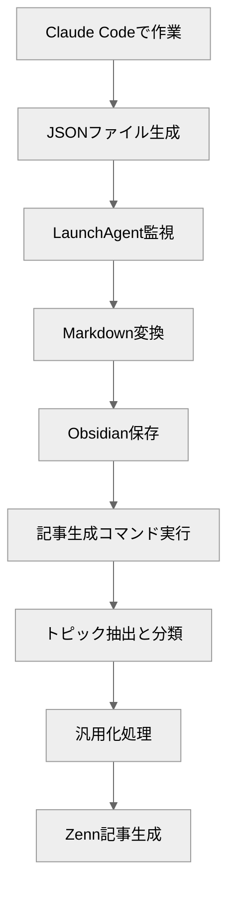

日々の開発作業では、エラーの解決方法、ライブラリの選定理由、実装の試行錯誤など、知らず知らずのうちに多くの知見が溜まっています。Claude Codeとの会話にはとくに、問題解決のプロセスや意思決定の理由が記録されており、これを誰かのヒントにできれば有益です。

そこで、会話を自動的にObsidianに保存し、さらにZenn記事として生成するワークフローを構築しました。

この仕組みは、以下の2つの優れた記事で紹介されているアプローチを参考にしています：

https://zenn.dev/pepabo/articles/ffb79b5279f6ee

https://blog.shibayu36.org/entry/2025/07/30/092458

本記事では、これらの手法を組み合わせ、**Zenn記事として自動生成する機能** を追加したワークフローを紹介します。

:::message
記事の途中で各フェーズの詳細を解説していますが、`/obsidian-to-zenn`コマンドの全文は記事の後半に掲載しています。
:::


## ワークフローの全体像



ポイントは、**完全自動化で会話を蓄積し、記事化は人間が選択する**こと。
会話は自動でObsidianに保存され、価値あるトピックだけを記事化することで、効率性と品質を両立します。

## セットアップ手順

### 前提条件

- macOS（Linuxの場合はcronで代替可能）
- Claude Codeがインストールされている
- Obsidianを使用している
- jqコマンドがインストール済み（`brew install jq`）

### 1. 監視スクリプトの作成

`~/.claude/hooks/watch-and-save.sh`を作成します。

:::message
この実装は[栗林健太郎さんの記事](https://zenn.dev/pepabo/articles/ffb79b5279f6ee)を参考にしています。
:::

```bash
#!/bin/bash

CLAUDE_DIR="$HOME/.claude/projects"
OBSIDIAN_DIR="$HOME/Documents/Obsidian/Claude Code"

# 今日の日付（YYYY-MM-DD形式）
TODAY=$(date +%Y-%m-%d)
OUTPUT_FILE="$OBSIDIAN_DIR/$TODAY.md"

# 出力ファイルが存在しない場合は作成
if [ ! -f "$OUTPUT_FILE" ]; then
    echo "# Claude Code - $TODAY" > "$OUTPUT_FILE"
    echo "" >> "$OUTPUT_FILE"
fi

# 各プロジェクトのJSONLファイルを処理
for project_dir in "$CLAUDE_DIR"/*/; do
    if [ ! -d "$project_dir" ]; then
        continue
    fi

    # 最新のJSONLファイルを取得
    latest_jsonl=$(ls -t "$project_dir"*.jsonl 2>/dev/null | head -n 1)

    if [ -z "$latest_jsonl" ]; then
        continue
    fi

    # 今日の日付のメッセージのみを抽出して変換
    jq -r --arg today "$TODAY" '
        select(.timestamp != null) |
        select(.timestamp | startswith($today)) |
        select(.type == "message") |
        select(.role == "user" or .role == "assistant") |
        if .role == "user" then
            "**ユーザー**: \(.content)"
        else
            # Claude (assistant) の場合、content が配列の可能性がある
            if (.content | type) == "array" then
                (.content | map(
                    select(.type == "text") | .text
                ) | join("\n\n") |
                if length > 0 then "**Claude**: \(.)" else empty end)
            else
                "**Claude**: \(.content)"
            end
        end
    ' "$latest_jsonl" >> "$OUTPUT_FILE"
done
```

実行権限を付与：

```bash
chmod +x ~/.claude/hooks/watch-and-save.sh
```

### 2. LaunchAgentの設定

`~/Library/LaunchAgents/com.claude.obsidian-sync.plist`を作成します。


```xml
<?xml version="1.0" encoding="UTF-8"?>
<!DOCTYPE plist PUBLIC "-//Apple//DTD PLIST 1.0//EN" "http://www.apple.com/DTDs/PropertyList-1.0.dtd">
<plist version="1.0">
<dict>
    <key>Label</key>
    <string>com.claude.obsidian-sync</string>
    <key>ProgramArguments</key>
    <array>
        <string>$HOME/.claude/hooks/watch-and-save.sh</string>
    </array>
    <key>StartInterval</key>
    <integer>5</integer>
    <key>RunAtLoad</key>
    <true/>
    <key>StandardOutPath</key>
    <string>/tmp/claude-sync.log</string>
    <key>StandardErrorPath</key>
    <string>/tmp/claude-sync.error.log</string>
</dict>
</plist>
```

LaunchAgentをロード：

```bash
launchctl load ~/Library/LaunchAgents/com.claude.obsidian-sync.plist

# 動作確認
launchctl list | grep claude
```

### 3. Obsidianディレクトリの作成

Obsidian Vaultに専用ディレクトリを作成します。

```bash
mkdir -p "$HOME/Documents/Obsidian/Claude Code"
```

これで、Claude Codeで作業すると自動的に日付別ファイル（例: `2026-01-21.md`）が生成されます。

### 4. /obsidian-to-zennコマンドの設定

`~/.claude/commands/obsidian-to-zenn.md`を作成します（詳細は後述）。

## 実装の詳細

### JSONL形式からMarkdownへの変換

Claude CodeのJSONLファイルは以下の構造です：

```json
{
  "type": "message",
  "role": "assistant",
  "content": [
    {"type": "text", "text": "実際の回答内容"},
    {"type": "tool_use", "id": "...", "name": "..."}
  ],
  "timestamp": "2026-01-21T10:30:00Z"
}
```

**重要な実装ポイント**:

1. **content配列の処理**: Claudeのレスポンスは`content`が配列になることがあるため、`type == "text"`のみを抽出
2. **日付フィルタ**: `timestamp`で今日のメッセージのみを抽出し、重複を防止
   - LaunchAgentは5秒ごとにスクリプトを実行
   - 日付フィルタがないと、同じJSONLファイル全体を毎回読み込み、過去のメッセージも重複追記される
   - 例: 10:00のメッセージが10:05、10:10、10:15と何度も追記され、同じ内容が大量に重複
3. **システムメッセージ除外**: `role`が`user`または`assistant`のみを対象とし、`system`やツール呼び出しを除外

:::details textのみ抽出することで失われる情報について
`content`配列には以下のタイプが含まれます：

- **`type: "text"`** - Claudeの回答テキスト（保存対象）
- **`type: "tool_use"`** - ツール呼び出し情報（Read、Edit、Bashなど）
- **`type: "tool_result"`** - ツールの実行結果（ファイル内容、コマンド出力など）

`text`のみを抽出することで、ツールの生データは除外されますが、**情報量の問題はありません**。理由は：

1. **Claudeが説明を含める**: Claudeは実行内容を`text`で説明します
   ```
   **Claude**: ファイルを確認します。
   [tool_use: Read] <- 除外
   [tool_result: ...] <- 除外
   **Claude**: エラーの原因は〇〇です。
   ```

2. **会話の流れを重視**: Obsidianでの用途は「何を考えたか」「どう解決したか」の記録であり、ツールの生データは不要

3. **可読性の向上**: ツール呼び出しの詳細を含めると、会話が冗長になり読みにくくなる

実際の会話では、Claudeの思考プロセスと結論が`text`に含まれているため、記事化や振り返りには十分な情報が保たれます。
:::

### Zenn記事生成コマンドの仕組み

`/obsidian-to-zenn`コマンドは、5つのフェーズで動作します：

#### Phase 1: 期間選択

対話的に対象期間を選択します。`AskUserQuestion`ツールで以下の選択肢を提供：

- **Today** - 今日のみ
- **2-3 days** - 過去2-3日間
- **1 week** - 過去7日間
- **Custom** - 任意の期間（ユーザーが日数を指定）

選択された期間内のObsidianファイル（YYYY-MM-DD.md）を対象とします。

**複数日にまたがるトピックに対応**するため、日付ベースではなく期間ベースで処理します。

#### Phase 2: 軽量なトピック抽出

大きなファイル（数千行〜数万行）をすべて読み込まずに、トピックの概要だけを効率的に抽出します。

**処理手順**:

1. **Grepでトピック境界マーカーを検索**
   ```bash
   # GitHub PR/Issue番号
   grep -n "github.com/.*/pull/[0-9]\+" file.md

   # コマンド実行タグ
   grep -n "<command-name>" file.md

   # ユーザー発話の開始
   grep -n "^\*\*ユーザー\*\*:" file.md
   ```

2. **トピックの統合**
   - 同じGitHub PR/Issue番号の会話は、複数日・複数ファイルにまたがっていても1つのトピックに統合
   - 同じコマンド実行タグの会話も統合
   - 日付ファイルの境界はトピック境界とは無関係

3. **最小限の読み込みで要約生成**
   - 各トピックの最初のユーザー発話のみを`offset/limit`で読み込み
   - トピック要約、会話数、日付範囲を表示

**トピック一覧の例**:
```
| # | トピック要約 | 会話数 | 日付範囲 |
|---|-------------|--------|----------|
| 1 | GitHub PR #118のレビューコメント対応 | 23 | 2026-01-14 〜 2026-01-15 |
| 2 | Obsidian会話保存スクリプトの実装 | 15 | 2026-01-14 |
| 3 | Composite Actionsの使い分け| 12 | 2026-01-08 〜 2026-01-14 |
```

#### Phase 3: トピック選択と詳細読み込み

`AskUserQuestion`ツールで、記事化したいトピックを選択します（複数選択可能）。

選択されたトピックのみ、Phase 2で特定した行番号範囲を使って`offset/limit`で効率的に読み込みます。

**複数ファイルにまたがるトピックの場合**:
- 各ファイルから該当範囲を読み込み
- 時系列順に結合

#### Phase 4: 汎用化処理

選択されたトピックの会話から、**汎用化できる知識だけ**を抽出します。

**除外する情報**:
- 固有名（社名/内部URL/具体リポ/秘密値/環境依存パス/顧客名）
- 必要な場合は `<REDACTED>` や `<PROJECT_ROOT>` 等のプレースホルダーに置換

**保持する情報**:
- ライブラリ名や公開仕様名
- 一般的な技術用語
- 汎用的なベストプラクティス

:::message
汎用化処理のアプローチは[shiba_yu36さんの記事](https://blog.shibayu36.org/entry/2025/07/30/092458)を参考にしています。
:::

#### Phase 5: 記事生成とプレビュー

Zenn記事形式で生成し、プレビュー表示してユーザー確認を取ります。

**Front Matter（Zenn仕様）**:
```yaml
---
title: "<自動生成した日本語タイトル>"
emoji: "📝"
type: "tech"
topics: ["topic1", "topic2"]  # 1〜5個
published: false              # 初期は下書き
publication_name: "lclco"     # Publicationに出す場合
---
```


**プレビュー表示**:
- 本文プレビュー（先頭500文字程度）
- ファイル名（`YYYYMMDD-slug.md`形式）
- 重要度スコア（1-5）
- 技術的正確さスコア（1-5）

ユーザー承認後、`articles/`ディレクトリに保存します。`published: false`で生成されるため、レビュー後に公開できます。

## 実際の使い方

### 会話の自動保存

Claude Codeで作業すると、自動的に以下の形式でObsidianに保存されます：

```markdown
# Claude Code - 2026-01-21

**ユーザー**: GitHub Actionsの共通化について相談したいです

**Claude**: GitHub Actionsの共通化には主に2つのパターンがあります:

1. **Composite Actions**: ステップレベルの再利用
2. **Reusable Workflows**: ワークフロー全体の再利用

どちらのパターンに興味がありますか？

**ユーザー**: Reusable Workflowsについて詳しく教えてください
```

### 記事生成

Claude Code内で`/obsidian-to-zenn`コマンドを実行：

```bash
/obsidian-to-zenn
```

実行フロー:
1. 日付一覧表示 → `2026-01-21`を選択
2. トピック抽出結果:
   ```
   ⭐⭐⭐⭐⭐ GitHub Actions共通化パターン
   ⭐⭐⭐⭐ Private Reusable Workflowsの認証
   ⭐⭐⭐ Composite Actionsの使い分け
   ```
3. トピック選択 → `GitHub Actions共通化パターン`を選択
4. 汎用化処理 → プロジェクト固有情報をプレースホルダ化
5. プレビュー表示 → 記事内容確認
6. ファイル出力 → `articles/20260121-github-actions-consolidation.md`

## `/obsidian-to-zenn` コマンド全文

以下が実際のコマンドファイルの全文です。`~/.claude/commands/obsidian-to-zenn.md`として保存してください。

**使用前に必ず以下を編集してください**：
- `obsidian_dir`: あなたのObsidianディレクトリパス
- `zenn_dir`: あなたのZennリポジトリの`articles`ディレクトリパス

:::details コマンド全文（クリックして展開）
~~~markdown
---
description: Obsidian保存済み会話から汎用知識を抽出し、話題ごとにZenn用Markdownを生成
allowed-tools: Bash(date:*), Read, Glob
---

## 設定

- obsidian_dir: <YOUR_OBSIDIAN_DIR>
- zenn_dir: <YOUR_ZENN_REPO>/articles
- 今日: !`date +%F`

## あなたの役割

あなたはベテランの技術系編集者として、Obsidianに保存された過去のClaude Code会話から**汎用化できる知識だけ**を抽出し、内容を整理して**Zenn リポジトリに保存する Markdown ファイル**を作成することが最終目標です。

## 実行フロー

### Phase 1: 期間選択

1. **Obsidianディレクトリから利用可能な日付ファイルを取得**
   ```bash
   # Glob tool で *.md ファイルを取得
   ```

2. **AskUserQuestionで期間を質問**

   以下の選択肢を提供:
   - **Today** - 今日のみ
   - **2-3 days** - 過去2-3日間
   - **1 week** - 過去7日間
   - **Custom** - 任意の期間（ユーザーが日数を指定）

   選択された期間に基づいて、該当する日付ファイルのリストを作成。

   **Customが選択された場合**:
   - AskUserQuestionで日数を追加質問（例: 10日、14日、30日など）

3. **対象ファイルのサマリーを表示**

   表示形式（マークダウンテーブル）:
   ```
   対象期間: 2026-01-14 〜 2026-01-21 (7日間)

   | 日付 | ファイルサイズ | 行数 | 備考 |
   |------|---------------|------|------|
   | 2026-01-21 | 89KB | 1,892行 | |
   | 2026-01-20 | 105KB | 2,450行 | |
   | 2026-01-14 | 116KB | 2,789行 | |

   合計: 3ファイル、310KB、7,131行
   ```

   **7000行超のファイルには警告表示**（⚠️ 大きなファイル）

### Phase 2: 軽量なトピック抽出

**目的**: 大きなファイルを全て読み込まずに、トピックの概要だけを効率的に抽出

1. **トピック境界マーカーの検索（Grep使用）**

   各ファイルに対して以下のパターンを検索:
   ```bash
   # GitHub PR/Issue番号
   grep -n "github.com/.*/pull/[0-9]\+\|github.com/.*/issues/[0-9]\+\|#[0-9]\+" file.md

   # コマンド実行タグ
   grep -n "<command-name>" file.md

   # ユーザー発話の開始
   grep -n "^\*\*ユーザー\*\*:" file.md
   ```

2. **トピックメタデータの構築**

   各ファイルから以下の情報を収集:
   - ユーザー発話の行番号リスト
   - GitHub PR/Issue番号とその行番号
   - コマンド実行タグとその行番号

   この情報から「トピック境界」を推定し、各トピックの行番号範囲を特定。

3. **トピック要約の生成（最小限の読み込み）**

   各トピックについて、最初のユーザー発話のみを`offset/limit`で読み込み:
   ```bash
   # 例: 行100からのトピック → offset=99, limit=10で最初の発話だけ読む
   ```

   **トピックの統合ルール**:
   - 同じGitHub PR/Issue番号の会話は、複数日・複数ファイルにまたがっていても1つのトピックに統合
   - 同じコマンド実行タグの会話も統合
   - 日付ファイルの境界はトピック境界とは無関係

   **トピック要約の生成**:
   - 最初のユーザー発話の先頭100文字
   - GitHub URL/Issue番号が含まれる場合は抽出して含める
   - 複数日にまたがる場合は日付範囲を表示
   - 例: "GitHub PR #118のレビューコメント対応（BASIC認証設定）[2026-01-14 〜 2026-01-15]"

4. **トピック一覧を表示**

   表示形式（マークダウンテーブル）:
   ```
   | # | トピック要約 | 会話数 | 日付範囲 |
   |---|-------------|--------|----------|
   | 1 | GitHub PR #118のレビューコメント対応（BASIC認証設定） | 23 | 2026-01-14 〜 2026-01-15 |
   | 2 | Obsidian会話保存スクリプトの実装 | 15 | 2026-01-14 |
   | 3 | YouTrack Issue navi_android-437の修正 | 12 | 2026-01-08 〜 2026-01-14 |
   ```

   **トピックは複数日にまたがる可能性があり**、同じGitHub PR/Issue/コマンドに関連する会話は自動的に統合されます。

### Phase 3: トピック選択と詳細読み込み

1. **AskUserQuestionでトピックを質問**

   抽出されたトピック一覧から、記事化したいトピックを選択:
   - 単一選択または複数選択（multiSelect: true）
   - 各トピックに以下の情報を表示:
     - トピック番号
     - トピック要約
     - 会話数
     - 日付範囲

2. **選択されたトピックの詳細読み込み**

   Phase 2で特定した行番号範囲を使用して、該当部分だけを効率的に読み込み:

   ```bash
   # 例: トピック1が2026-01-14.mdの行100-500の場合
   # Read tool で offset=99, limit=400 を指定
   ```

   **複数ファイルにまたがるトピックの場合**:
   - 各ファイルから該当範囲を読み込み
   - 時系列順に結合

### Phase 4: 汎用化処理

選択されたトピックごとに以下の処理を実行:

#### 抽出と一般化ルール
- 固有名（社名/内部URL/具体リポ/秘密値/環境依存パス/顧客名）は書かない。必要なら `<REDACTED>` や `<PROJECT_ROOT>` 等のプレースホルダーに置換。
- ライブラリ名や公開仕様名は可。設定値は原則サンプル値に一般化。
- 同じ話題なら1ファイルにまとめる。明らかに別の話題の場合、**別ファイル**に分割する。

#### タイトル生成（自動）
- 形式: **「主題: 成果/指針」**（40字前後）
- 具体語優先。プロジェクト名や社内語は入れない。

#### ファイル名
- 保存先: \`\${base_dir}/<YYYYMMDD>-<ascii-slug>.md\`
- <ascii-slug> は日本語タイトルをローマ字化→小文字→非英数を `-` に置換→連続 `-` を1個に圧縮→先頭末尾の `-` を除去→**12–50文字**に調整（Zenn規約）。

#### 出力仕様（本文の先頭に **必ず** Zennフロントマター）
すべての記事は冒頭に以下のFront Matterを含める：

```md
---
title: "<自動生成した日本語タイトル>"
emoji: "📝"
type: "tech"           # "tech"（技術）/"idea"（アイデア）
topics: []             # 1〜5個、小文字・英数字ベース推奨（例: ["ios","swift"]）
published: false        # 初期は下書き。公開時はtrueに変更
# publication_name: "<任意のPublication名>"  # Publicationに出す場合のみ指定
# published_at: "YYYY-MM-DD hh:mm"           # 予約公開（JST）。指定時はpublished: trueにする
---
```

- `published: true`にして **GitHubへプッシュ**するとZenn側に反映・公開される。公開予約は`published_at`（JST）で指定可能。
- Publicationへ紐付ける場合は`publication_name`を設定。

### Phase 5: プレビュー表示

各記事について以下を表示:

1. **本文プレビュー**（先頭500文字程度）
2. **ファイル名**
3. **重要度スコア**（1-5）
4. **技術的正確さスコア**（1-5）
5. **トピック分割の理由**（複数記事の場合）

表示形式:
```
━━━━━━━━━━━━━━━━━━━━━━━━━━━━━━━━━━━━━━
記事 1/3: LaunchAgent: macOSでのバックグラウンドプロセス常駐化
━━━━━━━━━━━━━━━━━━━━━━━━━━━━━━━━━━━━━━

ファイル名: 20260114-launchagent-macos-background-process.md
重要度: ★★★★☆ (4/5)
技術的正確さ: ★★★★★ (5/5)

【本文プレビュー】
---
title: "LaunchAgent: macOSでのバックグラウンドプロセス常駐化"
emoji: "🔄"
type: "tech"
topics: ["macos", "launchagent", "automation"]
published: false
---

## 背景
macOSでバックグラウンドプロセスを常駐化させるには...

[以下省略、全文は出力時に表示]

━━━━━━━━━━━━━━━━━━━━━━━━━━━━━━━━━━━━━━
```

### Phase 6: 承認とファイル出力

1. **ユーザーの承認を待つ**

   「出力してよろしいですか？」と確認。

   - 承認: **「出力して」** と発話
   - 編集要求: 「タイトルを変更して」「トピック1を除外」等
   - キャンセル: 「やめる」「cancel」

2. **ファイル出力**（承認後のみ）

   各ファイルを `~~~` で囲って**全文出力**:

   ```
   ~~~
   ファイル: <YOUR_ZENN_REPO>/articles/20260114-launchagent-macos-background-process.md

   ---
   title: "LaunchAgent: macOSでのバックグラウンドプロセス常駐化"
   emoji: "🔄"
   type: "tech"
   topics: ["macos","launchagent","automation"]
   published: false
   ---

   ## 背景
   ...（全文）...
   ~~~
   ```

3. **公開手順の提示**（オプション）

   公開する場合の手順:
   ```bash
   # published: false を true に変更してから
   git add -A
   git commit -m "publish: <slug>"
   git push

   # ローカル確認
   npx zenn preview
   ```

## エラーハンドリング

### ファイル関連エラー

- **Obsidianディレクトリが存在しない**:
  ```
  エラー: Obsidianディレクトリが見つかりません
  パス: <YOUR_OBSIDIAN_DIR>

  設定を確認してください。
  ```

- **ファイルが読み込めない**:
  パーミッションエラーとして報告

- **ファイルが空**:
  警告を出してスキップ

- **想定外のフォーマット**:
  ```
  警告: ファイル形式が想定と異なります
  期待: "**ユーザー**:" / "**Claude**:" 形式

  手動で確認してください。
  ```

### 処理エラー

- **トピックが検出されない**:
  "有効な会話が見つかりませんでした。別の日付を選択してください。"

- **日付範囲が不正**:
  ```
  エラー: 日付形式が不正です

  有効な形式:
  - 単一: 2026-01-14
  - 範囲: 2026-01-08 to 2026-01-14
  - 複数: 2026-01-08, 2026-01-13
  ```

- **ファイル出力失敗**:
  ```
  エラー: ファイルの保存に失敗しました
  保存先: <YOUR_ZENN_REPO>/articles/

  ディレクトリの存在と書き込み権限を確認してください。
  ```

### 大規模データ対応

- **7000行超のファイル**:
  ```
  ⚠️ 警告: 大きなファイルです（7,333行）
  処理時間: 約3-5分

  続行しますか？ (yes/no)
  ```

- **100トピック超**:
  トピック一覧をページネーション（最初の50件のみ表示、「もっと見る」オプション）

- **記事が10個超**:
  ```
  確認: 18件の記事を生成しようとしています

  すべて出力してよろしいですか？ (yes/no)
  ```

## 注意事項

1. **プロジェクト固有情報**
   - 完全な除外は困難（手動レビュー推奨）
   - 機密情報が含まれる場合は要注意

2. **会話の文脈**
   - 前後の文脈が切れると意味不明になる可能性
   - トピック分類の精度に依存

3. **記事品質**
   - 自動生成なので必ず人間がレビュー
   - 公開前に `published: true` に変更必須

4. **技術的制約**
   - Obsidianファイルは `YYYY-MM-DD.md` 形式である必要
   - `watch-and-save.sh` が生成する形式（`**ユーザー**:` / `**Claude**:`）に依存

## 実行開始

それでは、Phase 1から開始します。

Obsidianディレクトリから利用可能な日付ファイルを取得します...
~~~
:::

## まとめ

日々の開発で生まれる知見は、意識しないと散逸してしまいます。このワークフローで、Claude Codeとの会話を自動的に記録し、開発しながら知見を貯め、それが記事になり、また誰かの開発を助ける。そんなサイクルを回していきましょう。
