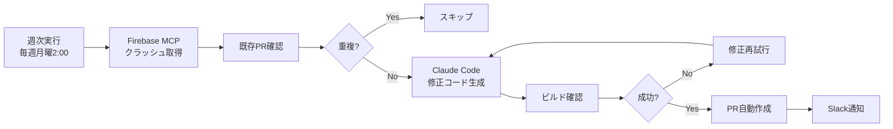

モバイルアプリのクラッシュ対応を Firebase MCP（Model Context Protocol）サーバーとClaude Code Actionを組み合わせて、クラッシュの検出から修正PRの作成まで完全自動化する仕組みを構築しました。

## この記事で得られること

- Firebase MCPを使ったCrashlyticsデータの自動取得方法
- クラッシュタイプ別の自動修正パターン設計
- 重複PR防止の実装テクニック
- Claude Codeを使った簡単セットアップ方法
- すぐに使えるGitHub Actionsワークフロー

## 自動化の全体像



ポイントは、**完全自動化ではなく「修正候補の自動生成＋人間レビュー」** にしたこと。パターン化できるクラッシュは自動で修正候補を作り、最終判断は人間が行うことで、安全性と効率性を両立します。

## セットアップ手順

この記事では、Claude Code CLIを使った最も簡単なセットアップ方法を紹介します。

### 前提条件

- Claude Codeがインストールされている
- Firebase Crashlyticsを使用している
- GitHubリポジトリがある

### 1. Firebase認証トークンの取得

まず、Firebase CLIの認証トークンを取得します。

```bash
# Firebase CLIインストール（未インストールの場合）
npm install -g firebase-tools

# 認証トークン取得
firebase login:ci
```

表示されたトークンをコピーして、GitHub Secretsに登録：

1. GitHubリポジトリの Settings → Secrets and variables → Actions
2. New repository secret
3. Name: `FIREBASE_TOKEN`、Value: コピーしたトークン

### 2. Claude Code OAuth トークンの設定

Claude Codeでプロジェクトを開き、以下のコマンドを実行：

```bash
/install-github-app
```

対話的にセットアップが進むので、画面の指示に従ってください。

### 3. Firebase MCP設定ファイルの作成

Claude Codeで以下のプロンプトを実行：

```
.github/firebase-mcp.config.json を作成してください。

Firebase MCPサーバーの設定：
- command: npx
- args: ["-y", "firebase-tools@latest", "experimental:mcp"]
```

### 4. クラッシュ修正プロンプトの作成

Claude Codeで以下のプロンプトを実行：

```
.github/claude/crashlytics-fix-prompt.md を作成してください。

以下の内容を含めてください：
- Firebase MCPの crashlytics_get_top_issues を使ってクラッシュ取得
- 重複PR防止の3層チェック（ラベル、ブランチ、リモートブランチ）
- クラッシュタイプ別の修正パターン（EXC_BAD_ACCESS、NSRangeException等）
- ブランチ名: fix/crashlytics-{issue_id}
- PRラベル: crashlytics-auto-fix, crashlytics-issue-{id}, bug
- ビルド確認を含む
- 変数置換: {{MAX_ISSUES}}, {{BASE_BRANCH}}, {{PR_TEMPLATE}}
```

詳細なプロンプトが自動生成されます。必要に応じてカスタマイズしてください。

### 5. GitHub Actionsワークフローの作成

Claude Codeで以下のプロンプトを実行：

```
.github/workflows/crashlytics-auto-fix.yml を作成してください。

要件：
- 毎週月曜日 午前2時UTC に自動実行
- 手動実行も可能（workflow_dispatch）
- Firebase MCPを使ってクラッシュ取得
- Claude Code Action (@anthropics/claude-code-action@v1) を使用
- プロンプトファイルから読み込み、変数を置換
- MCP設定: .github/firebase-mcp.config.json
- 許可ツール: Read, Edit, Write, Grep, Glob, Bash(git:*), Bash(gh:*), mcp__firebase__crashlytics_get_top_issues
- Slack通知（成功時、失敗時、PRなし時）
- タイムアウト: 30分
```

Claude Codeが自動的にワークフローファイルを生成します。


## 運用上のポイント

### 1. プロンプトの継続的改善

```markdown
# 月次レビューで以下を確認
- 生成されたPRの品質
- 修正が適切だったか
- 失敗したケースの原因

# プロンプトに追加
- 成功パターン: 良い修正例を追加
- 失敗パターン: うまくいかなかったケースの対策を追加
```

### 2. 実行頻度の調整

```yaml
# 週2回に変更（月曜・木曜）
schedule:
  - cron: '0 2 * * 1,4'

# または、日次実行
schedule:
  - cron: '0 2 * * *'
```

### 3. 対象クラッシュ数の調整

```bash
# プロンプト変数で調整
PROMPT="${PROMPT//\{\{MAX_ISSUES\}\}/10}"  # 上位10件に拡大
```

### 4. ドライランモード

```yaml
# テスト実行用（PRを作成せずログのみ）
claude_args: |
  --allowedTools "Read,Grep,Glob,Bash(gh pr list:*)"
  # Write, Edit を除外
```

## まとめ

Firebase MCPとClaude Code Actionを組み合わせることで、クラッシュ対応を自動化できました：

- **作業負担軽減**: パターン化できるクラッシュは自動で修正候補を生成
- **品質の一貫性**: 詳細なプロンプトで一貫した修正パターンを適用
- **チーム可視化**: Slack通知でクラッシュ対応状況を共有

修正候補の自動生成＋人間レビューにしたことでパターン化できる修正はAIに任せ、安全性と効率性を両立できます。ぜひ試してみてください。

## 完全なワークフローファイル

記事内で抜粋した部分を含む、完全な `.github/workflows/crashlytics-auto-fix.yml` は以下の通りです：

```yaml
name: Crashlytics Auto Fix

on:
  schedule:
    # 毎週月曜日 午前2時UTC
    - cron: '0 2 * * 1'
  workflow_dispatch:

concurrency:
  group: crashlytics-auto-fix
  cancel-in-progress: false

permissions:
  contents: write
  pull-requests: write
  issues: read

jobs:
  auto-fix-crashes:
    runs-on: ubuntu-latest
    timeout-minutes: 30

    steps:
      - name: Checkout repository
        uses: actions/checkout@v4
        with:
          fetch-depth: 0

      - name: Setup Node.js
        uses: actions/setup-node@v4
        with:
          node-version: '20'

      - name: Install Firebase Tools
        run: npm install -g firebase-tools@latest

      - name: Load and prepare prompt
        id: load_prompt
        run: |
          # プロンプトファイルを読み込み
          PROMPT=$(cat .github/claude/crashlytics-fix-prompt.md)

          # 変数を置換
          PROMPT="${PROMPT//\{\{MAX_ISSUES\}\}/5}"
          PROMPT="${PROMPT//\{\{BASE_BRANCH\}\}/main}"
          PROMPT="${PROMPT//\{\{PR_TEMPLATE\}\}/pull_request_template_bugfix.md}"

          # GitHub Outputに保存
          {
            echo "prompt<<EOF_PROMPT"
            echo "$PROMPT"
            echo "EOF_PROMPT"
          } >> $GITHUB_OUTPUT

      - name: Run Claude Code Action - Crashlytics Auto Fix
        id: claude_fix
        uses: anthropics/claude-code-action@v1
        env:
          FIREBASE_TOKEN: ${{ secrets.FIREBASE_TOKEN }}
        with:
          claude_code_oauth_token: ${{ secrets.CLAUDE_CODE_OAUTH_TOKEN }}
          github_token: ${{ secrets.GITHUB_TOKEN }}
          prompt: ${{ steps.load_prompt.outputs.prompt }}
          show_full_output: true
          claude_args: |
            --mcp-config .github/firebase-mcp.config.json
            --allowedTools "Read,
                            Edit,
                            Write,
                            Grep,
                            Glob,
                            Bash(git:*),
                            Bash(gh:*),
                            mcp__firebase__crashlytics_get_top_issues"

      - name: Check created PRs
        id: check_prs
        if: success()
        run: |
          # 過去1時間以内に作成されたPRを確認
          LATEST_PRS=$(gh pr list \
            --label "crashlytics-auto-fix" \
            --limit 5 \
            --json number,url,title,createdAt \
            --jq '[.[] | select(.createdAt > (now - 3600 | todate))]')

          PR_COUNT=$(echo "$LATEST_PRS" | jq 'length')
          PR_LIST=$(echo "$LATEST_PRS" | jq -r '.[] | "• \(.title) (\(.url))"')

          echo "pr_count=$PR_COUNT" >> $GITHUB_OUTPUT

          {
            echo "pr_list<<EOF"
            echo "$PR_LIST"
            echo "EOF"
          } >> $GITHUB_OUTPUT
        env:
          GITHUB_TOKEN: ${{ secrets.GITHUB_TOKEN }}

      - name: Notify Slack on Success (with PRs)
        if: success() && steps.check_prs.outputs.pr_count > 0
        uses: slackapi/slack-github-action@v1.26.0
        env:
          SLACK_WEBHOOK_URL: ${{ secrets.SLACK_WEBHOOK_URL }}
        with:
          payload: |
            {
              "text": "🤖 Crashlytics自動修正が完了",
              "attachments": [{
                "color": "good",
                "text": "${{ steps.check_prs.outputs.pr_count }}件のPRが作成されました",
                "fields": [{
                  "title": "作成されたPR",
                  "value": "${{ steps.check_prs.outputs.pr_list }}",
                  "short": false
                }]
              }]
            }

      - name: Notify Slack on Success (no PRs)
        if: success() && steps.check_prs.outputs.pr_count == 0
        uses: slackapi/slack-github-action@v1.26.0
        env:
          SLACK_WEBHOOK_URL: ${{ secrets.SLACK_WEBHOOK_URL }}
        with:
          payload: |
            {
              "text": "✅ Crashlytics自動修正完了。新しいクラッシュはありませんでした。"
            }

      - name: Notify Slack on Failure
        if: failure()
        uses: slackapi/slack-github-action@v1.26.0
        env:
          SLACK_WEBHOOK_URL: ${{ secrets.SLACK_WEBHOOK_URL }}
        with:
          payload: |
            {
              "attachments": [{
                "color": "danger",
                "title": "❌ Crashlytics自動修正ワークフローが失敗",
                "fields": [{
                  "title": "ワークフロー",
                  "value": "https://github.com/${{ github.repository }}/actions/runs/${{ github.run_id }}",
                  "short": false
                }]
              }]
            }
```
